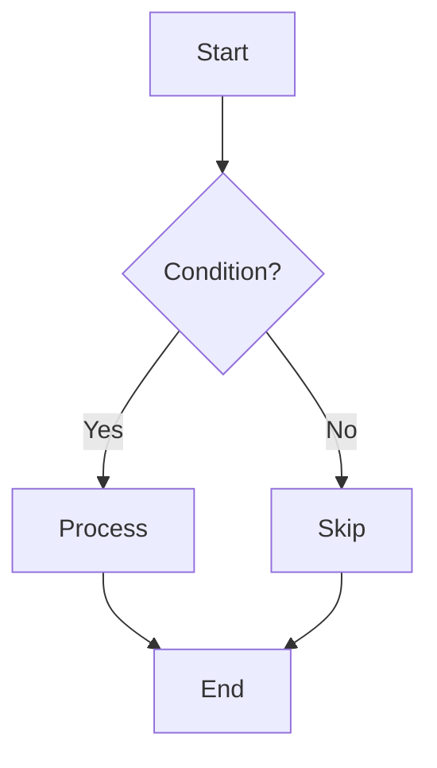
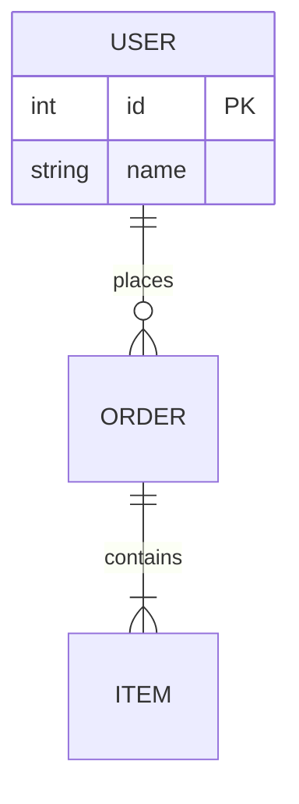

# Tech Diagram

Create technical diagrams using only two default routes:

- Mermaid: simple static diagrams embedded directly in Markdown
- React Flow + dagre: complex architecture diagrams, interactive flows, and step-based animations in single-file HTML

Do not default to hand-written SVG flowcharts or SVG + anime.js animations for complex HTML diagrams.

## Technology Selection

| Diagram Type | Technology | Output Format |
|-------------|------------|---------------|
| Simple Flowchart | Mermaid | Markdown code block |
| ER Diagram | Mermaid | Markdown code block |
| Sequence Diagram | Mermaid | Markdown code block |
| State Diagram | Mermaid | Markdown code block |
| Class Diagram | Mermaid | Markdown code block |
| Complex Architecture | React Flow + dagre | `.html` file |
| Interactive Flow / Animated Demo | React Flow + dagre | `.html` file |

## Route 1: Mermaid

Use Mermaid for simple static diagrams embedded in Markdown. See [mermaid-patterns.md](references/mermaid-patterns.md) for syntax reference.

### Good Fit
- Simple linear flows
- ER diagrams
- Sequence diagrams
- State/class diagrams that do not need interaction

### Flowchart Example
````markdown

````

### ER Diagram Example
````markdown

````

## Route 2: React Flow + dagre

Use React Flow + dagre for HTML diagrams that need one or more of the following:

- Automatic layout
- Stable node spacing and arrow routing
- Long labels that must not overflow node boxes
- Multi-stage focus switching
- Step-based animation using active nodes, animated edges, and right-side detail panels

References:

- [react-flow-dagre-pattern.md](references/react-flow-dagre-pattern.md)
- [animation-template.html](assets/animation-template.html) （作为唯一官方 React Flow + dagre 模板）

### Default Rules

When producing complex HTML diagrams, follow these rules by default (use `assets/animation-template.html` as the canonical template and adapt it per diagram):

1. Use React Flow for node and edge rendering.
2. Use dagre for automatic layout.
3. Keep node width and height consistent within the same diagram family.
4. Put long explanations in side panels, not directly inside nodes.
5. Use stage switching, node highlighting, and animated edges for animation.
6. Export a screenshot after validation and embed the screenshot in Markdown with a link to the HTML.

### Do Not

- Do not hand-draw complex node coordinates and arrow paths unless the diagram is truly tiny.
- Do not use SVG + anime.js as the default animation path.
- Do not let labels overflow node boxes.
- Do not mix raw payload detail and top-level architecture labels in the same node.

## Output Guidelines

### Mermaid Diagrams

Write Mermaid code blocks directly in Markdown documents:

````markdown

````

### React Flow HTML Diagrams

1. Create a single-file `.html` diagram based on `assets/animation-template.html`.
2. Use React Flow + dagre from CDN imports.
3. Validate the page in a browser.
4. Take a screenshot of the final state or most representative stage.
5. Embed screenshot + link in Markdown.

Example:

````markdown


[View interactive version](./docs/system-architecture.html)
````

### File Naming

- Architecture: `{system}-architecture.html`
- Interactive flow: `{system}-{workflow}.html`
- Screenshots: `./images/{same-name}.png`

### HTML File Requirements

- Keep the file self-contained (single HTML file)
- Inline CSS
- Use CDN ESM imports for React, React Flow, and dagre
- Support desktop width first, but do not break badly on mobile
- Use Chinese/English labels as needed

## Validation Checklist

Before claiming a diagram is done, verify:

- The page opens without console errors
- Node labels do not overflow
- Arrows and edge labels are readable
- Active stage switching works
- Screenshot is updated and matches the current HTML
